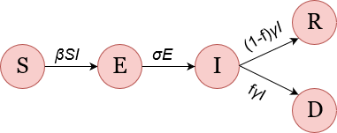

```{r setup, include=FALSE}
knitr::opts_chunk$set(echo = TRUE, cache = TRUE)
```

```{r, echo = F, message = F}
rm(list = ls())
library(deSolve)
library(pander)
```
# ToDo

* optimalisatie model
* opmaak plot
* vergelijkingen met ander uitbraken
* introductie
* materiaal & methode
* resultaten
* discussie & conclusie


\pagebreak

\tableofcontents

\pagebreak

# The Paper

## Introduction

In de moderne tijd is het heel erg makkelijk geworden om van het ene land naar het andere land te gaan omdat we nu kunnen vliegen. Dit heeft enorm veel voordelen maar dit heeft echter een groot probleem, virussen en bacteriën kunnen nu veel makkelijker van het ene land naar het andere land worden gebracht. Een van deze virussen is Ebola, dit virus is inmiddels al erg bekend geworden van de vele uitbraken in Afrika.


nieuwe uitbraak
 - Moet nog even kijken of dit een goede inleiding is - 

In this day and age the world is getting smaller and smaller. To get from europe to the united states it roughly takes 11 hours. This ease of travelling everywhere in the world within one day comes with one huge risk, the risk of spreading a dangerous infectious disease. On july 20, 2014 a infected passenger, with the Ebola virus disease (EVD), arrived in Nigeria. After a total of 20 cases where 8 died, Nigeria was cleared of the ebola virus on october 20, 2014 57 days. This shows what happens if 1 person is infected with ebola and begins to get in contact with others. Luckely by handeling fast not many people got infected with EVD because the authorities handeled quick. Through our simulations we are trying to replicate the outbreak in Nigeria and see what can happen if there wasn't a quick response and we like to show if this outbreak was a abnormlity or simular to other outbreaks.


    


[The Paper](https://www.sciencedirect.com/science/article/pii/S1755436515000341)

\pagebreak

# The Model




Figure 1: schemetic model for EVD infection spread. Susceptible induviduals *S* are infected by infectious individuals *I* at rate
$\beta$. Then they go through a incubation period *E* at rate   $\sigma$.
After incubation induviduals become infectious *I*. These infectious people either recover *R* or die *D* at rate $\gamma$. The fatality rate so how many people die or recover is given by *f*.


$dS/dT = -B(t)SI$

$dE/dT = B(t)SI - omegaE$

$dI/dT = omegaE - yI$

$dR/dT = (1-f)yI$

$dD/dT = fyI$

$Rt = BtS(t)/y$

$Ro = BoS/y$

```{r}
# time 57 dagen (4924800)
time <- seq(0,57,1)

# standaard parameters
st.para <- c(k = 0.19,
             f = 0.39,
             y =  0.71,
             omega = 0.33,
             t = 3,
             Bo = 1.22*10^-6,
             e = 2.71828182459)


# standaard standaard waarden
st.state <- c(S = 10^6,
              E = 0,
              I = 1,
              R = 0,
              D = 0)

low.para <- st.para
low.para["k"] <- 0.1 #0.1
low.para["f"] <- 0.14
low.para["Bo"] <- 1.22*10^-6 # 0.7

high.para <- st.para
high.para["k"] <- 0.38 # 0.38
high.para["f"] <- 0.71
high.para["Bo"] <- 1.22*10^-6 # 2.1


ebola.model <- function(time, para, state){
    with(as.list(c(state, para)),{
        Bt <- Bo * e^( -k * (time - t))
        
        dS <- -Bt * S * I 
        dE <- Bt * S * I - omega * E
        dI <- omega * E - y * I
        dR <- (1 - f) * y * I
        dD <- f * y * I
        
        return(list(c(dS, dE, dI, dR, dD)))
    })
}


st.out <- as.data.frame(ode(y = st.state,
                            times = time,
                            parms = st.para,
                            func = ebola.model))

high.out <- as.data.frame(ode(y = st.state,
                              times = time,
                              parms = high.para,
                              func = ebola.model))

low.out <- as.data.frame(ode(y = st.state,
                             times = time,
                             parms = low.para,
                             func = ebola.model))


colnames(st.out) <- c("Time",
                      "S",
                      "E", 
                      "I",
                      "R",
                      "D")

colnames(high.out) <- c("Time",
                      "S",
                      "E", 
                      "I",
                      "R",
                      "D")

colnames(low.out) <- c("Time",
                      "S",
                      "E", 
                      "I",
                      "R",
                      "D")

round.out <- round(st.out)
```

```{r, warning=FALSE, message=FALSE}

```

```{r}
# plots maken
# geen round meer, wel CL

# Susceptible people
plot(st.out$Time, st.out$S,
     type = "l",
     main = "amount of susceptible people over time",
     ylab = "Susceptible people",
     xlab = "Time in days",
     ylim = c(min(st.out$S) - 10, 10^6))
lines(high.out$Time, high.out$S,
      col = "red",
      type = "l",
      lty = 2)
lines(low.out$Time, low.out$S,
      col = "red",
      type = "l",
      lty = 2)

# Exposed people
plot(st.out$Time, st.out$E,
     type = "l",
     main = "Amount of exposed people over time",
     ylab = "Exposed people",
     xlab = "Time in days", 
     ylim = c(0, max(st.out$E) + 5))
lines(high.out$Time, high.out$E,
      col = "red",
      type = "l",
      lty = 2)
lines(low.out$Time, low.out$E,
      col = "red",
      type = "l",
      lty = 2)


# Infected people
plot(st.out$Time, st.out$I,
     type = "l",
     main = "Amount of infected people over time",
     ylab = "Infected people",
     xlab = "Time in days", 
     ylim = c(0, max(st.out$I) + 5))
lines(high.out$Time, high.out$I,
      col = "red",
      type = "l",
      lty = 2)
lines(low.out$Time, low.out$I,
      col = "red",
      type = "l",
      lty = 2)

# Recovered people
plot(st.out$Time, st.out$R,
     type = "l",
     main = "Amount of people that have recoverd over time",
     ylab = "Recovered people",
     xlab = "Time in days", 
     ylim = c(0, max(st.out$R) + 5))
lines(high.out$Time, high.out$R,
      col = "red",
      type = "l",
      lty = 2)
lines(low.out$Time, low.out$R,
      col = "red",
      type = "l",
      lty = 2)

# Dead people
plot(st.out$Time, st.out$D,
     type = "l",
     main = "Amount of dead people over time",
     ylab = "Dead people",
     xlab = "Time in days", 
     ylim = c(0, max(st.out$D) + 5))
lines(high.out$Time, high.out$D,
      col = "red",
      type = "l",
      lty = 2)
lines(low.out$Time, low.out$D,
      col = "red",
      type = "l",
      lty = 2)
```

```{r}
difference.by.day <- function(x, collumn){
  day.before <- as.numeric(subset(round.out,Time == x[1] - 1, select = collumn))
  diff <- x[collumn] - day.before
  if (is.na(diff)) {
      diff <- 0
  }
  return(diff)
  
}

difference.by.day.norm <- function(x, collumn){
  day.before <- as.numeric(subset(st.out,Time == x[1] - 1, select = collumn))
  diff <- x[collumn] - day.before
  if (is.na(diff)){
      diff <- 0
  }
  return(diff)
}

diffrence.infections <- function(x){
  collumns <- c("I", "R", "D")
  total.cases.before <- sum(as.numeric(subset(st.out,
                                              Time == x[1] - 1,
                                              select = collumns)))
  
  total.cases.after <- sum(as.numeric(subset(st.out,
                                             Time == x[1],
                                             select = collumns)))
  diffrence <- total.cases.after - total.cases.before
  
  return(diffrence)
  
}

difference.dead.norm <- apply(st.out, 1, difference.by.day.norm, "D")

difference.recovered <- apply(round.out, 1, difference.by.day, "R")
difference.dead <- apply(round.out, 1, difference.by.day, "D")

daily.new.cases <- apply(st.out, 1, diffrence.infections)
# plot(time, difference.susceptible,
#      pch = 16)
# 
# plot(time, difference.exposed,
#      pch = 16)
# 
# plot(time, difference.infected,
#      pch = 16)

plot(time, difference.recovered,
     main = "amount of recovered people per day",
     ylab = "recovered",
     xlab = "day",
     pch = 0)

plot(time, difference.dead,
     main = "amount of deceased per day",
     ylab = "deceased",
     xlab = "day",
     pch = 0)

plot(time, daily.new.cases,
     main = "New cases per day",
     ylab = "Cases",
     xlab = "time",
     type = "l")


```

\pagebreak

# aantekeningen verslag
 * let op de bronnen, zorg ervoor dat er geen plagiaat is
 
introductie
    eerste paragraaf
        introductie onderwerp, intresse krijgen
        geeft context en probleem, welk probleem wil je oplossen
        wat is het doel
        
    volgende paragraven
        achtergrond van het onderwerp
        context, zie de paper/onderzoek. wat is hier al gedaan
        Historie van model (evt.)
        Problemen
        -> Studie
    
    Indeling Verslag

Methoden
    Waar komt data/model vandaan
    Model beschrijven visueel (inkscape, draw.oi, dia) & formules (niet als plaatjes)
    inline formule is met #$, formule appart is met dubbel
    aanpak/ variatie
    Analyse
    hier moeten ook nog de programma's in de je gebruikt("we doen analyse met R")(veel programma's met versie erbij in een apparte tabel)
    
Resultaten

Conclusie/Discussie

Bronnen