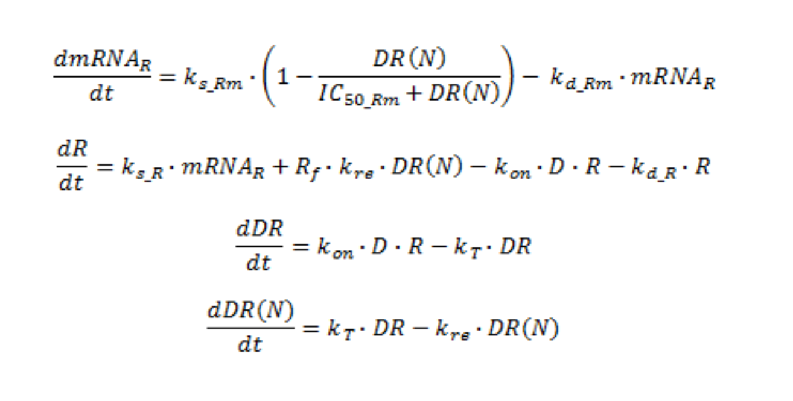

```{r setup, include=FALSE}
knitr::opts_chunk$set(echo = FALSE, cache = T)
```

```{r, echo = F, message = F}
rm(list = ls())
```

\tableofcontents

\pagebreak

# Inleiding

Corticosteroïden zijn steroïdhormonen die worden gebruikt tegen ontstekingen en infecties. Dit steroïdhormoon wordt  gemaakt in de bijnier en bestaat voornamelijk uit twee groepen, glucocorticosteroïden en mineralocorticosteroïden. De meeste corticosteroïden die worden gebruikt zijn glucocorticosteroïden, daarom zal hier ook grotendeels alleen uitleg staan over Glucocostreroïden. Deze corticosteroiden worden veel gebruikt tegen aandoeningen, zoals asma. De glucocorticosteroïden werken door ontstekingsremmende genen te activeren en de expressie genen die ontstekkingen laten onstaan te induceren.[1] In dit onderzoek willen wij graag de effecten van het corticosteroïde MPL bekijken en zien of het een effectief medicijn is.

\pagebreak

# Materiaal en Methoden

In dit project modeleren wij de expressie van gluecocortiocoide receptoren, waarbij remming optreed door coricosteroiden.

Er wordt verwacht dat wanneer er medicijnen toegedient word, Dat de expressie van de GR receptor daalt zodat de ontsteking geremt wordt. Het medicijn dat wij gebruiken is methylprednisolon (MPL) gebruikt als coricosteroide.


in het model(figuur 1) beinvloeden Glucocorticosterioiden(bij ons MPL) de hoeveelheid transcriptie van ontstekings factoren en ze hebben ook een remmend effect op de transcriptie van eigen receptoren door de binding van het geactiveerde sterioide-receptir complex aan het glucocorticoid response element. D is de plasma concentratie van het MPL in molair. Dit is de dosis van het medicijn MPL. mRNAR staat voor de hoeveelheid receptor mRNA en deze wordt beinvloed door de waarde ks_Rm omdat deze voor de synthese zorgt van het GR mRNA, ook wordt hij beinvloed door kd_Rm deze zorgt voor de afbraak van het GR mRNA. R staat voor de vrije gluocorticoid receptor dichtheid in het cytocol. R wordt beinvloed door de variablen ks_R, deze zort voor de synthese van de receptor en kd_R zorgt voor de afbraak van de receptor. DR is de dichtheid van het MPL receptor complex en wordt geregeld door de variabele kon, deze regeld de aanmaak van MPL-receptor complex en KT, deze zorgt voor de translocatie van MPL-receptor complex en deze beinvloed dus ook de DR(N) want dit is de hoeveelheid MPL-receptor complex in de nucleus. ook wordt deze beinvloed door kre deze variable zorgt ook voor translocatie van het complex. daarnaast zijn er nog 2 variablen Rf & IC50_Rm. Rf is de hoeveelheid vrije receptor die gerecycled wordt. IC50_Rm is de concentratie MPL-receptor complex in de nucleus waarbij de aanmaak van receptor mRNA daalt tot 50% van de basis waarde.



```{r}
library(pander)

pander(state <- c(Rmo = 4.740, 
           Ro = 267,
           DR = 0,
           DRN = 0), style = "rmarkdown", caption = "Tabel 1:Startwaardes")
```
In tabel 1 zijn onze startwaardes te zien. Rmo staat voor het basisniveau van de concentratie mRNA in fmol/ g liver en Ro is het basisniveau van de concentratie vrije receptor.

Voor dit project is de programmeertaal R gebruikt, dit is een programmeertaal die veel wordt gebruikt voor statistische berekeningen en modeleren. Het is een vierde generatie codeertaal en heeft ook veel pakketen wat er voor zorgt dat je de taal voor veel dingen kunt gebruiken [2], voor dit verslag wordt bijvoorbeeld veel gebruik gemaakt van het paket deSolve. Voor dit verslag is versie 3.3.3 gebruikt van R,

DeSolve is een pakket waarmee je gemakkelijk differentiaalvergelijkingen kunt oplossen, dit pakket is door Karline Soetaert, Thomas Petzoldt en R. Woodrow Setzer ontworpen. Voor dit project is versie 1.21 gebruikt. De code die veel is gebruikt tijdens dit onderzoek was $ODE()$, dit stukje code kan gewone eerste-orde differentiaalvergelijkingen doen, die veel nodig zijn om een goed model te kunnen maken. [3]


\pagebreak

# Resultaten

```{r}
pander(para <- c(ksrm = 2.9,
          IC50rm = 26.2,
          kdrm = 0.612,
          ksr = 3.22,
          kre = 0.57,
          kon = 0.00329,
          kdr = 0.0572,
          kt = 0.63,
          Rf = 0.49,
          D = (20 * 1000) / 371.471 ),
       style = "rmarkdown", caption= "Tabel 2: Standaard parameters")
```

```{r,echo = T}
library(deSolve)

data <- read.csv("MPL.csv", header = T, na.strings = "NA")

medians <- aggregate(data[,c("MPL_conc","mRNA","Free_receptor")],
                     list(data$dose,data$time), median, na.rm=T)
names(medians)[1:2] <- c("dose","time")

time <- seq(0, 168, 1)

low_dose <- para
high_dose <- para
low_dose["D"] <- ((14.59 * 1000) / 371.471)
high_dose["D"] <- ((39.925 * 1000) / 371.471)

cocortisocosteroid.model <- function(time, para, state){
    with(as.list(c(state, para)),{
        dmRNA <- ksrm * (1 - DRN / (IC50rm + DRN)) - kdrm * Rmo
        dR <- ksr * Rmo + Rf * kre * DRN - kon * D * Ro - kdr * Ro
        dDR <- kon * D * Ro - kt * DR
        dDRN <- kt * DR - kre * DRN
        
        return(list(c(dmRNA, dR, dDR, dDRN)))
        }
    )
}

out <- ode(y = state,
           times = time,
           parms = high_dose,
           func = cocortisocosteroid.model,
           method = "euler")

out2 <- ode(y = state,
           times = time,
           parms = low_dose,
           func = cocortisocosteroid.model,
           method = "euler")
```

```{r, echo = F}
par(mfrow = c(1,2), oma = c(0, 0, 2, 0))
plot(out[,1], out[,2],
     type = "l", 
     xlab = "Tijd in uur",
     ylab = "fmol/g mRNAR",
     ylim = c(0, 5),
     sub = "Dose van 39.925 ng/ml")
lines(medians[,2][medians$dose == 0.3| medians$dose == 0.0], 
      medians[,4][medians$dose == 0.3| medians$dose == 0.0],
      col = "red",
      type = "o",
      lty = 1,
      pch = 16)
legend("topright",
       c("Simulatie", "Medians"),
       col = c("black", "red"),
       lty = c(1, NA),
       pch = c(NA, 16))


plot(out2[,1], out2[,2],
     type = "l", 
     xlab = "Tijd in uur",
     ylab = "fmol/g mRNAR",
     ylim = c(0, 5),
     sub = "Dose van 14.59 ng/ml")
lines(medians[,2][medians$dose == 0.1| medians$dose == 0.0], 
      medians[,4][medians$dose == 0.1| medians$dose == 0.0],
      col = "red",
      type = "o",
      lty = 1,
      pch = 16)
legend("topright",
       c("Simulatie", "Medians"),
       col = c("black", "red"),
       lty = c(1, NA),
       pch = c(NA, 16))

mtext("Concentratie mRNAR over 168 uur", outer = TRUE, cex = 1.5)

par(mfrow = c(1,2), oma = c(0, 0, 2, 0))
plot(out[,1], out[,3],
     type = "l", 
     xlab = "Tijd in uur",
     ylab = "fmol/g vrije receptoren",
     ylim = c(0, 300),
     sub = "Dose van 39.925 ng/ml")
lines(medians[,2][medians$dose == 0.3| medians$dose == 0.0], 
      medians[,5][medians$dose == 0.3| medians$dose == 0.0],
      col = "red",
      type = "o",
      lty = 1,
      pch = 16)
legend("topright",
       c("Simulatie", "Medians"),
       col = c("black", "red"),
       lty = c(1, NA),
       pch = c(NA, 16))

plot(out2[,1], out2[,3],
     type = "l", 
     xlab = "Tijd in uur",
     ylab = "fmol/g vrije receptoren",
     ylim = c(0, 300),
     sub = "Dose van 14.59 ng/ml")
lines(medians[,2][medians$dose == 0.1| medians$dose == 0.0], 
      medians[,5][medians$dose == 0.1| medians$dose == 0.0],
      col = "red",
      type = "o",
      lty = 1,
      pch = 16)
legend("topright",
       c("Simulatie", "Medians"),
       col = c("black", "red"),
       lty = c(1, NA),
       pch = c(NA, 16))

mtext("Hoeveelheid vrije receptoren over 168 uur", outer = TRUE, cex = 1.5)
```

```{r, echo = T}
time <- seq(0, 96, 1)

para1 <- para
para1["ksrm"] <- (2.9  / 5) 
para1["kdrm"] <- (2.9 / 5 / 4.74)
#para1["D"] <-((0 * 1000) / 371.471 )

para2 <- para
para2["ksrm"] <- (2.9 / 2) 
para2["kdrm"] <- (2.9 / 2 / 4.74 )
#para2["D"] <-((0 * 1000) / 371.471 )

para3 <- para
para3["ksrm"] <- (2.9 * 5) 
para3["kdrm"] <- (2.9 * 5 / 4.74)
#para3["D"] <-((0 * 1000) / 371.471 )

para4 <- para
para4["ksrm"] <- (2.9 * 2) 
para4["kdrm"] <- (2.9 * 2 / 4.74)
#para4["D"] <-((0 * 1000) / 371.471 )

no_drug <- para
no_drug["ksrm"] <- (2.9 * 2)
no_drug["kdrm"] <- (2.9 * 2 / 4.74)
no_drug["D"] <- ((0 * 1000) / 371.471)

ks_rm1 <- ode(y = state,
            times = time,
            parms = para1,
            func = cocortisocosteroid.model
            )

ks_rm2 <- ode(y = state,
            times = time,
            parms = para2,
            func = cocortisocosteroid.model
            )

ks_rm3 <- ode(y = state,
            times = time,
            parms = para3,
            func = cocortisocosteroid.model
            )

ks_rm4 <- ode(y = state,
            times = time,
            parms = para4,
            func = cocortisocosteroid.model
            )

no_drug1 <- ode(y = state,
            times = time,
            parms = no_drug,
            func = cocortisocosteroid.model
            )

normaal <- ode(y = state,
            times = time,
            parms = para,
            func = cocortisocosteroid.model
            )
```

```{r}
plot(ks_rm4[,1], ks_rm4[,2],
     type = "l",
     xlab = "Tijd in uren",
     ylab = "fmol/g mRNAR",
     main = "mRNAR concentratie over tijd")

lines(ks_rm1[,1], ks_rm1[,2],
      col = "red")
lines(ks_rm2[,1], ks_rm2[,2],
      col = "blue")
lines(ks_rm3[,1], ks_rm3[,2],
      col = "green")
lines(no_drug1[,1], no_drug1[,2],
      col = "purple")
lines(normaal[,1], normaal[,2],
      col = "orange")

legend("bottomright",
       c("ks_Rm = 2.9 / 5 en kd_Rm = 2.9 / 5 / 4.74", 
         "ks_Rm = 2.9 / 2 en kd_Rm = 2.9 / 2 / 4.74", 
         "ks_Rm = 2.9 * 2 en kd_Rm = 2.9 * 2 / 4.74",
         "ks_Rm = 2.9 * 5 en kd_Rm = 2.9 * 5 / 4.74",
         "geen medicijn, ks_Rm = 2.9 * 2 en kd_Rm=2.9 * 2 / 4.74",
         "normaal"),
       col = c("green", "red", "blue", "black", "purple", "orange"),
       lty = 1,
       cex = 0.75)
```

\pagebreak

# Discussie & Conclusie


\pagebreak

# Bronnen

1. Glucocorticoids , Wikipedia, 24 mei 2018, [https://en.wikipedia.org/wiki/Glucocorticoid](https://en.wikipedia.org/wiki/Glucocorticoid)
2. R (programming language), Wikipedia, 24 mei 2018, [https://en.wikipedia.org/wiki/R_(programming_language)](https://en.wikipedia.org/wiki/R_(programming_language))
3. CRAN - Package deSolve, 9 mei 2018, [https://cran.r-project.org/web/packages/deSolve/index.html](https://cran.r-project.org/web/packages/deSolve/index.html) 
4. Project webpage , [https://bioinf.nl/~fennaf/thema08/](https://bioinf.nl/~fennaf/thema08/)

